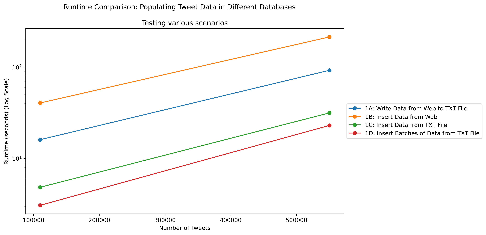
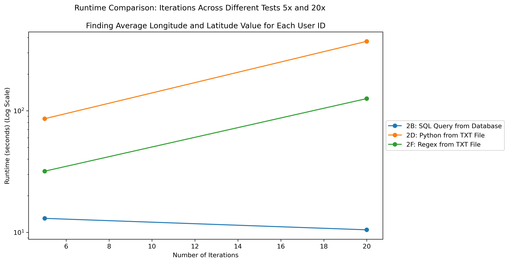

## Dataset

This dataset, OneDayOfTweets.txt, was sourced from the link below. It contains a total of 4.4M tweets in text format. 
- [Tweets Data Source: OneDayOfTweets.txt](https://dbgroup.cdm.depaul.edu/DSC450/OneDayOfTweets.txt)

## Purpose

This project aims to populate databases and retrieve information in various methods using this Twitter data and compare their performances. 

Populating databases with 110,000 tweets and 550,000 tweets and comparing runtime.

## Part 1: Creating Databases using SQL

**1A: Write Data from Web to TXT File using Python Functions**
- This TXT file will be used for parts 1C, and 1D.

| Metric                                       | 110,000 Tweets | 550,000 Tweets |
|----------------------------------------------|----------------|----------------|
| Runtime (seconds) saving tweets in txt file | 14.56          | 69.67          |

**1B: Insert Data from Web using SQL**

| Metric           | 110,000 Tweets | 550,000 Tweets |
|------------------|----------------|----------------|
| Runtime (seconds) | 35.03          | 232.08         |

**1C: Insert Data from TXT File using SQL**

| Metric           | 110,000 Tweets | 550,000 Tweets |
|------------------|----------------|----------------|
| Runtime (seconds) | 4.77           | 24.49          |

**1D: Insert Batches of Data from TXT File using SQL**

| Metric           | 110,000 Tweets | 550,000 Tweets |
|------------------|----------------|----------------|
| Runtime (seconds) | 3.46           | 18.91          |

## How do the Runtimes Compare in Part 1?

This plot below displays runtime comparisons across various database population techniques. It uses log scale to visualize the data better. 

Based on the observations, inserting data from the web (1B) has a higher runtime compared to inserting data from a TXT file (1C). 

Writing data from the web to a TXT file (1A) has the second-highest runtime.

In these particular tests, inserting data from a TXT file through batches (1D) has the fastest runtime. This could be due to the nature of how memory loads onto a computer. 

Although the difference between tests 1C and 1D is small, this difference could make an impact on a much larger amount of data.

## Part 2: Compare Runtime of Information Retrieval using SQL vs. Functions

**Find the average longitude and latitude value for each user ID: 5 Iterations vs. 20 Iterations**

**2A: SQL query to retrieve information**

    SELECT user_id, AVG(longitude) AS avg_longitude, AVG(latitude) AS avg_latitude
    FROM Tweet INNER JOIN Geo ON Tweet.geo_id = Geo.geo_id
    GROUP BY user_id;

**2B: Execute the SQL query from 2A on the Web Database (550,000 Tweets)**

| Metric                                      | 5 iterations | 20 iterations |
|---------------------------------------------|--------------|---------------|
| Total runtime (seconds)                     | 7.0552       | 5.4047        |
| Average runtime per iteration (seconds)     | 1.4110       | 0.2702        |

**2C: Create a function that retrieves the information by reading it from the TXT file (550,000 Tweets)**

    Function name: execute_python_iterations_2C(path_name, iteration_counts)

**2D: Execute the function from 2C**

| Metric                                      | 5 iterations | 20 iterations |
|---------------------------------------------|--------------|---------------|
| Total runtime (seconds)                     | 66.3988      | 467.6484      |
| Average runtime per iteration (seconds)     | 13.2798      | 23.3824       |

**2E: Create a function that retrieves the information using regular expressions by reading it from the TXT file (550,000 Tweets)**

    Function name: execute_regex_iterations_2E(path_name, iteration_counts)

**2F: Execute the function from 2E**

| Metric                                      | 5 iterations | 20 iterations |
|---------------------------------------------|--------------|---------------|
| Total runtime (seconds)                     | 18.1508      | 76.6739       |
| Average runtime per iteration (seconds)     | 3.6302       | 3.8337        |

## How do the Runtimes Compare in Part 2?

This plot below displays runtime comparisons across find the average longitude and latitude value for each user ID for 5 and 20 iterations. It uses log scale to visualize the data better. 

Based on the tests, it is clear that using SQL to query from a database (2B) to answer the question trends to a lower runtime as the iterations increase. 

We can observe how reading directly from a TXT file (2D) has the highest runtime, followed by reading from a TXT file through regular expressions (2F).

